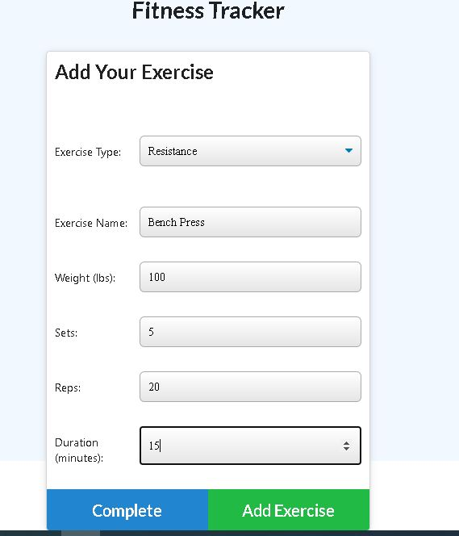
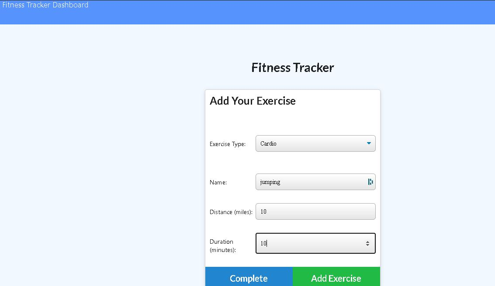
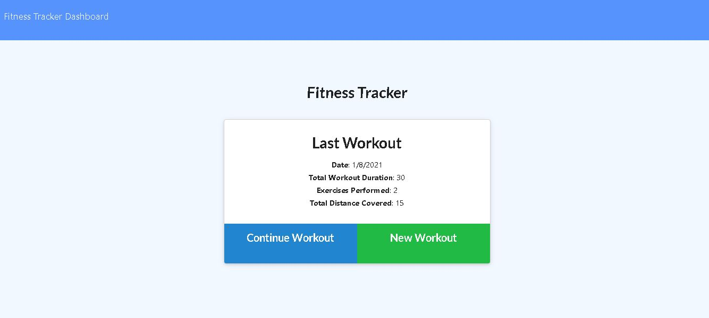
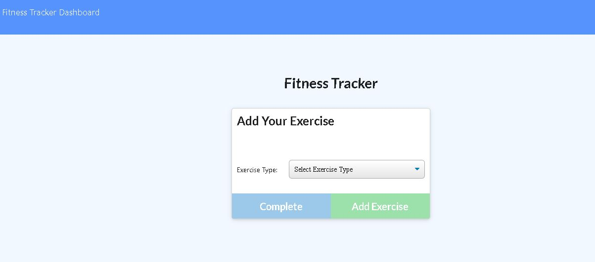
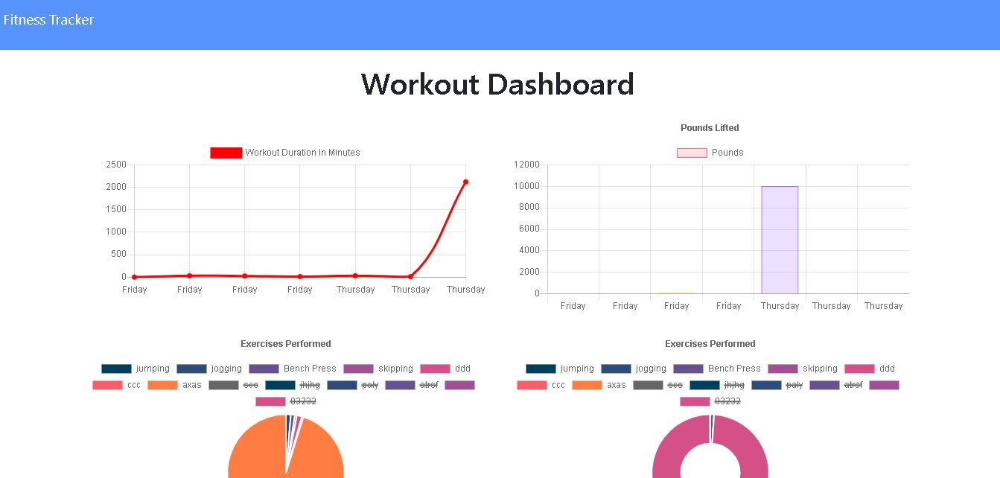

  # Welcome to fitness-tracker (1.0.0)
  <a href="#">
    
  </a>


  ## Description 

  > In this web based application a user can view create and track daily workouts. This application is created with MongoDb, Node, Express, Mongoose. It can perform the following functions :
  

  *  Add exercises to the most recent workout plan.

  * Add new exercises to a new workout plan.

  * View the combined weight of multiple exercises from the past seven workouts on the `stats` page.

 * View the total duration of each workout from the past seven workouts on the `stats` page.

This app will store all the records in mondoDb except the "total duration". Mongoose virtual is used so that user can see the total duration even when the data is not stored into database.
It is returned only when the data is fetched.
 

## Screen shots











## Live application

[Click here!!!](https://shielded-springs-69412.herokuapp.com/)


  ## Table of Contents

  * [Homepage](#homepage)
  * [Installation](#installation)
  * [Usage](#usage)
  * [Tests](#tests)
  * [Author](#author)
  * [Contributing](#contributing)
  * [License](#license)
  * [Questions](#questions)
  
  
  ## Homepage

  🏠 [Homepage](https://github.com/arpita-sahakar/fitness-tracker#readme)
  

  ## Installation
  Run the following command to install all the required libraries
  ```bash
  npm install
  ```

 
  ## Usage 
   Run the following command to start the server
  ```bash
  node server.js
  ```


  ## Tests
  ```bash
  npm run test
  ```


  ## Author

  👤 **Arpita Kar**
  * GitHub: [@arpita-sahakar](https://github.com/arpita-sahakar)


  ## Contributing

  Contributions, issues and feature requests are welcome!

  Feel free to check [issues page](https://github.com/arpita-sahakar/fitness-tracker/issues). You can also take a look at the [contributing guide](https://github.com/arpita-sahakar/fitness-tracker).


  ## Questions

  Please send your questions and suggestions to [my email](arpita.sahaa@gmail.com)
  * GitHub: [@arpita-sahakar](https://github.com/arpita-sahakar)


  ## License

  Copyright © 2020 [Arpita Kar](https://github.com/arpita-sahakar).

  This project is [NPM](https://github.com/arpita-sahakar/fitness-tracker/blob/main/license) licensed.

  
 

